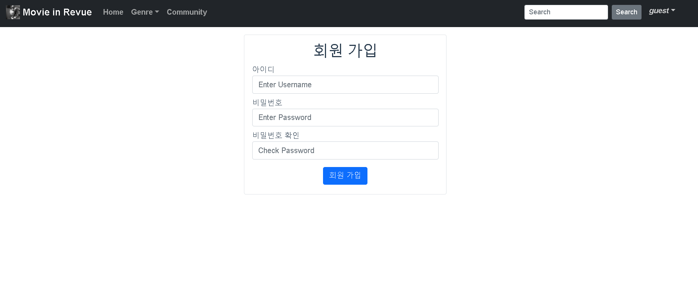

# PJT10 Vue를 활용한 SPA 구성

일시 : 2021.05.27

사용 툴: VSCode / REST_API / Google Chrome / Vue / AJAX / bootstrap V5 / Django / JavaScript

제작자: 최 용 욱, 김 수 빈

 

# 팀원 정보 업무 분담 내역
## 최용욱
1. 업무: back-end 및 영화 목록 구현

2. 중요 작업 순서 및 어려웠던 점
- 외부 API를 장고의 데이터베이스에 맞게 파싱
- 구현에 필요한 API들과 해당 API를 저장할 모델들 정의
- 검색창 및 nav bar 구현
- 좋아요 기능 구현 간 어려움을 느꼈습니다. 

## 김수빈
1. 업무: front-end 및 커뮤니티 구현
2. 중요 작업 순서 및 어려웠던 점
- 필요한 페이지 구상 및 url 매핑과 이에 기반한 스켈레톤 코드 작성
- back-end와 통신하며 페이지 구현
- local storage에 있는 데이터를 사용해야하는데 db에 저장된 데이터를 불러와 사용하려해 발생한 문제들이 많이 있었습니다.

 

# 프로젝트의 요구사항
## 1. 영화 정보 데이터베이스 구현
 - 데이터베이스 모델링(ERD)
 

## 2. 영화 커뮤니티에 필요한 기능 구성
### 1) main페이지
 
 
 1. 최상단에 nav-bar가 위치하고, 페이지의 이동과 검색, 로그인 회원의 username을 확인할 수 있습니다.
 2. 캐러셀로 매초 이미지가 바뀌는 화면을 구현했습니다.
 3. 현재 상영중인 영화의 리스트가 카드 형태로 보입니다. 클릭시 영화 상세 페이지로 이동합니다.

 ### 2) 회원가입/ 로그인 페이지
 
 
 1. 부트스트랩 form을 활용해 로그인과 회원가입 페이지를 구현했습니다.
 2. 적절하지 못한 입력값을 넘겨주면 붉은색 글씨로 에러 메시지가 나타나고, 페이지가 넘어가지 않습니다.
 3. 로그인이나 signup 성공시 로그인 된 상태로 main 페이지로 넘어갑니다.

 ### 3) movie detail 페이지
 
 1. 영화 제목이나 썸네일카드 등을 타고 링크를 넘어오면 영화 상세 정보를 확인할 수 있습니다.
 2. 영화가 마음에 든다면 좋아요를 누를 수 있습니다.
 3. 영화의 리뷰를 작성할 수 있습니다.
 4. 해당 영화에 작성된 영화 리뷰 목록을 확인하고, 상세 리뷰 목록으로 넘어갈 수 있습니다.

 5. 해당 영화와 유사한 영화 리스트를 추천해줍니다. TMDB의 api를 사용했습니다.

 ### 4) 리뷰 작성, 디테일, 수정, 삭제 페이지
 
 1. 영화 디테일 페이지에서 해당 영화에 관한 리뷰와 평점을 남기는 페이지로 넘어올 수 있습니다.
 
 2. 상세 리뷰 페이지 입니다. 작성자이름을 클릭하면 작성자 profile 페이지로 이동할 수 있고, 리뷰에 좋아요를 누를 수 있습니다.
 3. 해당 리뷰에대한 댓글 목록을 볼 수 있고, 댓글을 작성할 수 있습니다. 이 때 댓글의 작성자와 로그인한 user가 같다면 수정 삭제도 가능합니다.
 
 
 
 4. 로그인한 user와 리뷰를 작성한 user가 같다면 edit 과 delete 버튼이 나타납니다.
 5. 등록한 리뷰의 수정과 삭제 작업이 가능합니다.

 ### 5) 장르별 구분
 
 1. nav-bar의 장르를 누르면 여러 영화 장르가 나오고, 장르를 클릭하면 장르별 영화 리스트를 볼 수 있는 페이지가 나옵니다.
 2. 영화 클릭시 영화 상세 페이지로 갈 수 있습니다.

 ### 6) community 페이지
 
 1. 유저들이 남긴 모든 리뷰를 볼 수 있는 게시판 형태입니다.
 2. 게시판에 리뷰에대한 정보가 주어져있고, 클릭하면 상세 리뷰 페이지로 이동할 수 있습니다.
 
 ### 7) 검색
 
 1. nav-bar의 검색창에 단어를 검색하면 관련된 영화의 정보가 나타납니다.

 ### 8) 프로필
 
 1) 해당 유저의 팔로워 수와 팔로우 수를 확인할 수 있습니다.
 2) 로그인한 유저와 프로필 페이지의 유저가 같지 않다면 팔로우/ 언팔로우를 할 수 있는 버튼이 있습니다. 팔로우 중인 경우에는 언팔로우, 팔로우중이 아니라면 팔로우 버튼이 나옵니다.
 3) 해당 유저가 좋아요를 누른 영화가 나옵니다.
 4) 해당 유저가 작성한 리뷰의 리스트가 나옵니다.

## 3. 최소한의 HTML/CSS 이용한 사이트 디자인
 

## 프로젝트의 목표 및 실제 구현 정도
1. 영화 정보 사이트 tmdb의 외부 API를 활용한 데이터베이스 구축 완료
2. 영화 장르별 구분 및 영화를 고른 사용자에게 해당 영화와 비슷한 영화 추천 기능 구현 완료
3. 영화별로 각각의 리뷰를 작성할 수 있는 커뮤니티 기능 구현 완료
4. 검색 기능 구현 완료
5. 영화별 사용자의 좋아요 기능 구현 하였으나 하나의 영화만 좋아요 가능한 정도로만 구현됨

## 필수 기능에 대한 설명
1. 관리자 뷰의 경우 백엔드 측에서 서버 실행시 자동으로 외부 API를 불러와 데이터베이스를 구축하는 형태로 구현하였기에 별도의 관리자 권한을 요구하지 않았습니다.  
다만 장고 내에서 관리자 권한은 존재하여 유저 관리가 가능하게 하였습니다.

2. 영화 정보의 경우 tmdb 외부 API를 통해 가져오는데 tmdb의 외부 API는 20개 단위로 불러오기 때문에 최소 40개 이상의 데이터를 가져오게 구현하였습니다.  평점 기능의 경우 해당 영화에 대한 리뷰를 작성할 때 평점을 등록/수정/삭제할 수 있게 구현하였습니다.

3. 영화 추천 알고리즘의 경우 특정 영화를 클릭 할 시 해당 영화의 디테일 페이지로 넘어간 후 페이지 내에서 해당 영화와 비슷한 영화를 사용자에게 보여주는 방식을 채택했습니다.  
구현을 위해 해당 영화를 본 이용자들이 본 다른 영화들의 정보를 외부 API를 통해 받아 별도의 model을 구축하여 보여주는 방식으로 구현했습니다.

4. 커뮤니티는 영화 별로 보여주는 리뷰를 전체적으로 볼 수 있는 게시판으로써 구현했으며 댓글을 달거나 해당 사용자가 어떠한 영화에 대해 리뷰를 달았는지, 해당 리뷰에 대한 좋아요 등이 가능하게 구현하였습니다.
 
 

# 프로젝트를 통해 느낀 점
1. 최용욱 
처음에 프로젝트를 시작할 때 아예 처음부터 시작했기 때문에 막막하고 할 수 있을까? 라는 두려움이 있었습니다. 
그러나 팀원분이 제가 부족한 부분을 채워주시고 서로 도우면서 페어 프로그래밍이 잘 진행되어 프로젝트 진행간 시간에 쫓기지 않고 제작에 전념할 수 있었습니다.  또한 프로젝트를 시작하고 하루동안 깃 사용법에 대해 복습하고 ERD 및 구조를 미리 정하고 프로젝트를 제작했는데 그 덕분에 시간을 효율적으로 사용하며 프로젝트를 진행할 수 있었습니다.

2. 김수빈 
비어있는 부족한 개념들을 확인할 수 있는 시간이었습니다. 수업만으로 완전히 숙지하지 못했던 내용과 흐름들을 직접 구현하면서 이해하는 과정에 큰 도움이 되었습니다. 
javascript와 vue 사용에 익숙하지 않았지만 용욱님의 많은 도움으로 과정 중 발생한 많은 에러들과 문제점들을 확인하고 해결할 수 있었습니다.  
git 협업 툴 사용법을 익힐 수 있었습니다. 거의 사용 해보지 않아서 익숙하지 않았지만, 1주일간 수십 번 commit push pull을 반복하고, 충돌을 해결하고 하면서 git과 약간은 가까워진 것 같습니다. 
혼자서 완성시키기에는 버거웠겠지만 팀원분이 함께해 주셔서 잘 만들어 낼 수 있었던 것 같아 용욱님께 진심으로 감사합니다. 
프로젝트를 진행하면서 어느 부분이 부족한지, 어떤 부분을 잘 모르는지 피부로 느꼈고, 이 부분을 보충하는 시간이 필요할 것 같습니다.

